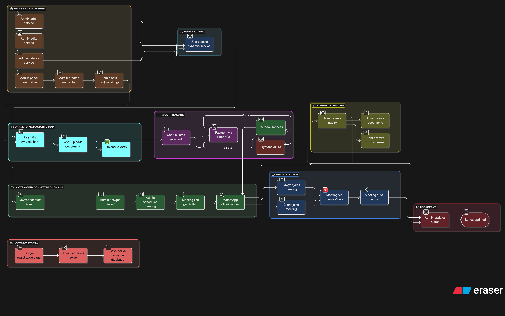

### Project flow

Use this doc to keep the end‑to‑end workflow up to date. The diagram below is the source of truth for the overall process.

### High-level stages

- **Admin service management**

  - Admin adds/edits/deletes services
  - Admin panel form builder: creates dynamic forms and sets conditional logic

- **User onboarding**

  - User selects a dynamic service

- **Dynamic form and document upload**

  - User fills the dynamic form
  - User uploads documents
  - Files are uploaded to AWS S3

- **Payment processing**

  - User initiates payment (PhonePe)
  - Handle success and failure paths

- **Admin inquiry handling**

  - Admin views inquiry, documents, and form answers

- **Lawyer assignment and meeting scheduling**

  - Admin assigns lawyer
  - Admin schedules meeting
  - Meeting link is generated and WhatsApp notification sent

- **Meeting execution**

  - Lawyer and client join meeting (Twilio Video)
  - Meeting auto-ends

- **Status update**

  - Admin updates case/status

- **Lawyer registration**
  - Lawyer registration page → Admin confirms → Save active lawyer in DB
